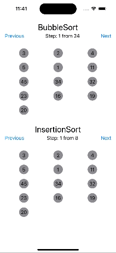

# AlgorithmVisualizer

The purpose of this app is to visualize algorithms using SwiftUI.

## Tools

The app is implemented using Swift programming langauge version 5.9.2. The UI part is done using SwiftUI. 
Deployment target is iOS 15.0. 

## UI Architecture

The app is implemented using MVVM architecture. 
- `ViewModel`is responsible for routing calls from the View and transforming the data for presentation.

Navigation:
Navigation is not covered in this demo. 

## Demo

